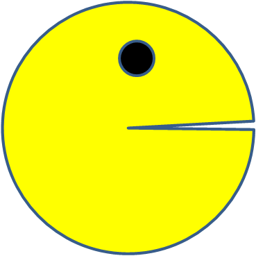

<h1 align="center">
  PacMen Factory
   
</h1>
<h4 align="center">A fancy way to learn emulating motion in a webpage</h4>

  
  
  
  

  <a href="#description">Description</a> •
  <!-- <a href="#file-manifest">Files</a> • -->
  <a href="#how-to-run">How To Run</a> •
  <a href="#roadmap-of-future-improvements">What's next?</a> •
  <a href="#contributing">Contributing</a> •
  <a href="#credits">Credits</a> •
  <a href="#license-information">License</a>

# Description
PacMen Factory is an exploratory exercise I've done as part of the [full-stack web developer certificate](https://executive-ed.xpro.mit.edu/professional-certificate-coding) I'm pursuing. The idea of this exercise is to help understanding the concepts of asynchronous programming and callback functions in javascript, as well as interacting with the [DOM](https://developer.mozilla.org/en-US/docs/Web/API/Document_Object_Model) via javascript and exploring formatting capabilities by using [CSS styles](https://www.w3schools.com/html/html_css.asp) and [bootstrap](https://getbootstrap.com/) templates.

By using a set of pacman images in different states (see images below) and the use of the function [`setTimeout`](https://developer.mozilla.org/en-US/docs/Web/API/setTimeout), we create the illusion of motion of the little creatures appearing on the screen, pretty much like the concept behind [movie creation](https://en.wikipedia.org/wiki/Film).

Set of pacman images used to create the illusion of motion. 

 By alternating between the open and closed mouth pacman images at regular intervals, the pacman appears to be moving.

By defining an area within the page we setup the boundaries for the pacmen, so they can only "move" within that area. The photo of the nice beach defines these boundaries. There are 3 other scenes, that are randomly cycled everytime the game is reset (or the page is reloaded).

The buttons to the left and the slider at the bottom, allow controlling the action (see [How to Run section](#how-to-run)).

The page has been formatted mainly with [bootstrap](https://getbootstrap.com/) and the [bootswatch](https://bootswatch.com) theme [SpaceLab](https://bootswatch.com/spacelab/). Some minor modifications are also performed through my own css style file. 

# How to Run
The set of buttons to the left of the scene allows to control the game:
* **Add Pacman**: creates a new pacman and places it in a random position within the area. By [modifying the hue of the source images](https://developer.mozilla.org/en-US/docs/Web/CSS/filter), we give the impression of re-colouring (pseudo) randomly every new pacman.
* **Start Game**: starts the motion of the pacmen. When created, every pacmen is assigned a random speed and placed at a random position, so when they start "moving", it appears they move with different velocities across the area. Motion is achieved by shifting the position of the images in a small amount and alternating between pacman images (i.e. mouth closed/open), between calls to the function [setTimeout](https://developer.mozilla.org/en-US/docs/Web/API/setTimeout). 
* **Stop Game**: pauses the action, leaving every pacmen static within the area, they can regain movement by just clicking **Start Game** again, or moving the speed slider (see below)
* **Reset Game**: stops the action, cleans up the screen (i.e. removes all the pacmen) and changes the scene, by selecting another background image

Below the background image, there is a slider that changes the speed of all the pacmen. This slider operates as an accelerator for all the pacmen, by increasing all the speeds in the same relative amount (i.e. accelerates the whole scenery).

Click the pacman to play with this demo: 

# Roadmap of future improvements
This is a fun excercise that allows practising a lot of interesting concepts behind front-end development.  By no means this is a finalised project, there are many improvements that can think of, and because it is an open source project, I'll be happy to see any improvement or changes perfomed by others to make this a more interesting learning tool.

Some of the improvements I have in my ToDo list are:
* Make the change in speed induced by the slider to be random for every pacmen, rather than increasing it on the same amount. At the moment, the slider affects the delay parameter in the [setTimeout](https://developer.mozilla.org/en-US/docs/Web/API/setTimeout) function, so the speed of all pacmen is increased in the same proportion. If we want to make that change random for every pacman, we need to change the programming logic as the slider should affect the actual speed of every pacmen, rather than the delay of the whole scene.

* Add boundaries within pacmen, so everytime they crash, they change direction. I'm not sure how to achieve that, but I'd guess it will require to consider other pacmen's position as another boundary, so would need to add that into some of the branching at the `checkCollisions` function

* Add music. By playing with it, I can already imagine hearing some mumbling that increases with the number of pacmen (pretty much like a kids party :rofl: :rofl:)
# Contributing
Pull requests are welcome, although I'm not sure will be reviewing them periodically. I'll also be happy to chat about any improvement or extension that could be donde to this app.

# Credits
This software uses the following third party tools:
* The background image scenes are my own photos, which I've taken on different travel with my :camera: Nikon DSLR
* [Bootstrap](https://getbootstrap.com/) based theme [Spacelab](https://bootswatch.com/spacelab/), from [bootswatch](https://bootswatch.com)
* The background wallpaper is from [KindPng](https://www.kindpng.com/imgv/ooJoxJ_baby-pacman-arcade-machine-hd-png-download/)

# License information
This project is licensed under the terms of <a href="https://github.com/jlulloaa/pacmen/blob/main/LICENSE" target="_blank"> MIT license </a>

